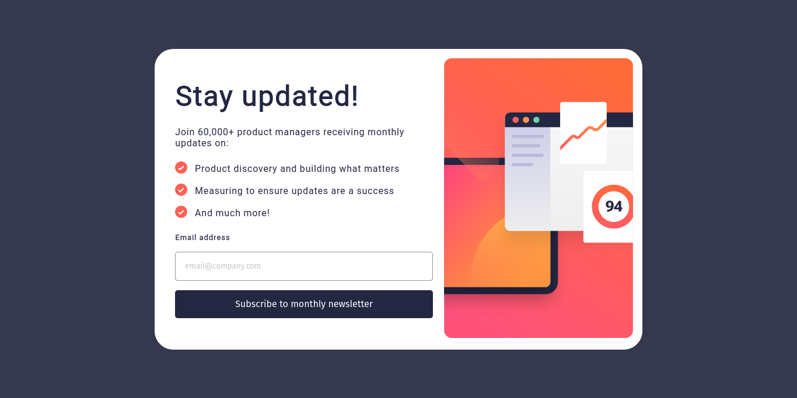
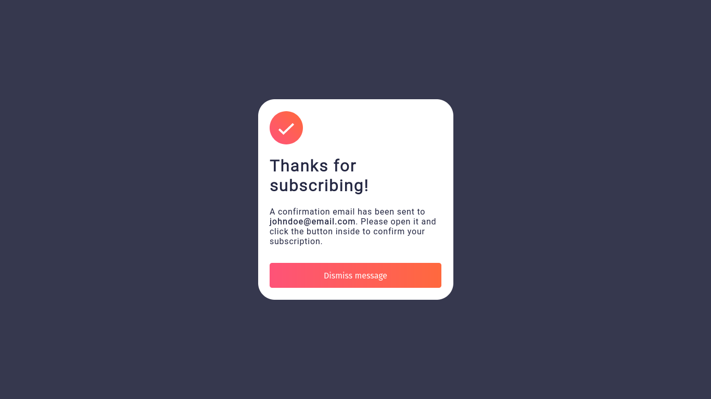
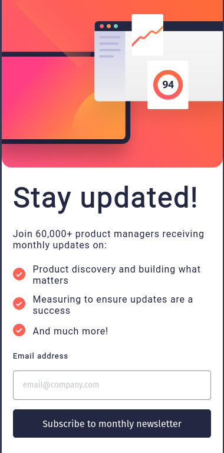
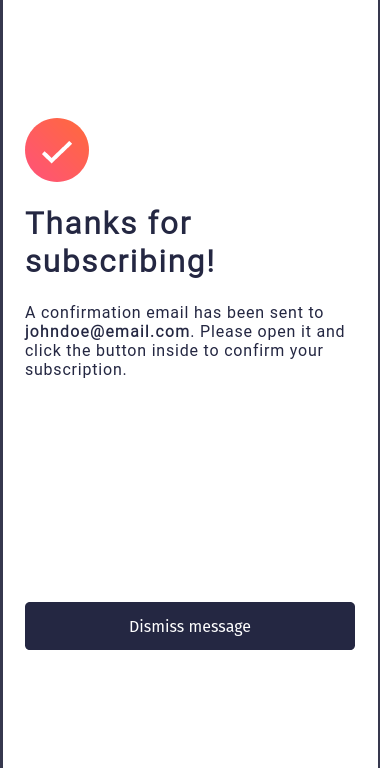

# Frontend Mentor - Newsletter sign-up form with success message solution

This is a solution to the [Newsletter sign-up form with success message challenge on Frontend Mentor](https://www.frontendmentor.io/challenges/newsletter-signup-form-with-success-message-3FC1AZbNrv). Frontend Mentor challenges help you improve your coding skills by building realistic projects.

#

## Table of contents

- [Overview](#overview)
  - [The challenge](#the-challenge)
  - [Screenshot](#screenshot)
  - [Links](#links)
- [My process](#my-process)
  - [Built with](#built-with)
  - [What I learned](#what-i-learned)
  - [Continued development](#continued-development)
  - [Useful resources](#useful-resources)
- [Author](#author)
- [Acknowledgments](#acknowledgments)

#

## Overview

### The challenge

Users should be able to:

- Add their email and submit the form
- See a success message with their email after successfully submitting the form
- See form validation messages if:
  - The field is left empty
  - The email address is not formatted correctly
- View the optimal layout for the interface depending on their device's screen size
- See hover and focus states for all interactive elements on the page

#

### Screenshots

#### Desktop preview

- 
- 
- 

#

#### Mobile preview

- 
- 

#

### Links

- Live Site URL: [https://dalethese-newsletter-sign-up.netlify.app](https://dalethese-newsletter-sign-up.netlify.app)

#

## My process

### Built with

- Mobile-first workflow
- CSS custom properties
- Flexbox
- CSS Grid
- [React](https://reactjs.org/) - JS library
- [Styled Components](https://styled-components.com/) - For styles

#

### What I learned

In this project, I had the opportunity to tackle my first challenge created with React. As I have been learning React for a short time, it was an exciting and challenging experience. Through this project, I was able to apply my basic knowledge of React and gain more familiarity with the library.

Although this is just the beginning of my journey with React, I am excited to continue learning and exploring the features and possibilities that React offers.

#

### Continued development

In this section, I will outline the areas in which I plan to continue focusing on in future projects. These are concepts that I still don't feel completely comfortable with and techniques that I find useful and would like to refine and perfect.

- Deepen my knowledge in React: I want to explore more advanced concepts of React, such as using contexts, routing, and state management with Redux or other data flows.
- Improve my styling skills: I aim to enhance my CSS skills and explore styling frameworks and libraries like Styled Components to create more dynamic and styled interfaces.
- Learn advanced responsiveness techniques: I will continue studying and practicing advanced responsiveness techniques, such as using media queries and flexible grids, to create responsive and adaptable layouts for different devices.
- Deepen my understanding of testing: I plan to learn more about automated testing and how to implement unit tests and integration tests in my projects to ensure code quality and stability.
- Explore related libraries and tools: There are many libraries and complementary tools to React that I haven't fully explored yet, such as React Router, Redux, Axios, among others. I want to learn how to use them efficiently to improve my development skills.

## Author

- Frontend Mentor - [@Dalethese](https://www.frontendmentor.io/profile/yourusername)
- Instagram - [Jonas Dalethese](https://www.instagram.com/jonas_daleth/)
